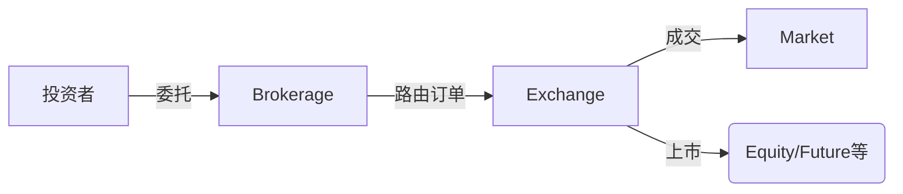

# 金融核心概念关系梳理

## 1. 基础定义
- **Brokerage（券商/经纪商）**  
  提供交易中介服务的金融机构，连接投资者与市场（如股票、期货交易）

- **Market（市场）**  
  资产交易的场所或机制（分现货市场、衍生品市场等）

- **Exchange（交易所）**  
  标准化交易的中央平台（如NYSE、CME），是市场的具体组织形式

- **Future（期货）**  
  标准化衍生品合约，约定未来特定时间以预定价格买卖标的资产

- **Equity（权益）**  
  代表公司所有权的资产（通常指股票）

- **产品（Product）**  
  可交易的金融工具统称（股票、债券、期货合约等）

## 2. 层级关系
```
金融市场体系
├─ 交易所（Exchange）→ 提供标准化交易场所
│ ├─ 现货市场（股票/债券等）
│ └─ 衍生品市场（期货/期权等）
├─ 场外市场（OTC）
└─ 经纪商（Brokerage）→ 交易执行通道
```

## 3. 产品分类
| 产品类型       | 标的资产          | 典型交易所       |
|----------------|-------------------|------------------|
| **Equity**     | 公司股票          | NYSE, NASDAQ     |
| **Future**     | 商品/金融资产/指数 | CME, CBOT        |
| ETF            | 股票/债券组合     | 各大股票交易所   |
| 期权           | 各类基础资产      | CBOE, 欧交所     |

## 4. 交互流程

## 5. 关键区别
- Exchange vs Market

    交易所是市场的子集（市场包含OTC等非集中交易）

- Future vs Equity

    - 期货：杠杆工具、有到期日、标准化

    - 股票：所有权凭证、长期持有

- Brokerage角色

    不直接提供产品，而是提供市场/交易所的产品访问通道

## 什么是阿尔法什么是贝塔？

1. 贝塔（Beta）——像“坐过山车的刺激程度”

想象你和朋友去游乐园：

- 贝塔=1：你坐的过山车和乐园里平均过山车一样刺激（比如大盘指数）。
- 贝塔=1.5：你坐的过山车比平均刺激50%（比如科技股，涨跌都很猛）。
- 贝塔=0.5：你坐的是儿童小火车，比平均过山车平稳一半（比如水电股，波动小）。
- 贝塔=负数：你坐的过山车和别人反着跑（市场跌你涨，比如黄金股）。

一句话总结：贝塔告诉你，这个投资是不是“心跳项目”。

2. 阿尔法（Alpha）——像“厨师的手艺加成”

你去两家餐馆吃饭：

- 餐馆A：菜的味道和预制菜一模一样（Alpha=0，相当于指数基金）。
- 餐馆B：同样的食材，但厨师多加了秘制酱料，比预制菜好吃10%（Alpha=10%）。

关键点：

- 阿尔法是超出预期的惊喜（基金经理的选股能力）。
- 如果市场涨10%，你的基金涨15%，多出的5%可能就是Alpha。

3. 因子（Factor）——像“选美食的标准”

你想选一家好吃的餐馆，可能会看：

- 价值因子：选“量大便宜”的（比如低市盈率股票）；
- 动量因子：选“最近很多人排队”的（近期涨得好的股票）；
- 质量因子：选“米其林大厨掌勺”的（公司盈利能力强）。

这些“标准”就是因子，用来帮你挑出能赚更多钱的股票（阿尔法）或避开高风险的股票（贝塔）。

终极比喻：打游戏

- 贝塔：你是战士，装备越重（贝塔越高），打怪伤害波动越大（涨跌猛）。
- 阿尔法：你点了特殊技能树（选股策略），能打出额外伤害（超额收益）。
- 因子：你参考的攻略秘籍（比如“优先加攻击力”就是价值因子）。

总结：

- 想躺平？选低贝塔（少刺激） + 阿尔法=0（不追求超额）。
- 想暴富？找高阿尔法（好厨师） + 高贝塔（坐火箭过山车）！
- 害亏钱？避开高贝塔（比如比特币） + 负阿尔法（菜鸟基金经理）。
