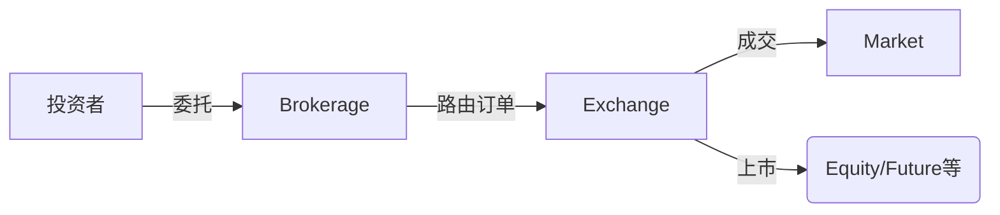

# 金融核心概念关系梳理

## 1. 基础定义
- **Brokerage（券商/经纪商）**  
  提供交易中介服务的金融机构，连接投资者与市场（如股票、期货交易）

- **Market（市场）**  
  资产交易的场所或机制（分现货市场、衍生品市场等）

- **Exchange（交易所）**  
  标准化交易的中央平台（如NYSE、CME），是市场的具体组织形式

- **Future（期货）**  
  标准化衍生品合约，约定未来特定时间以预定价格买卖标的资产

- **Equity（权益）**  
  代表公司所有权的资产（通常指股票）

- **产品（Product）**  
  可交易的金融工具统称（股票、债券、期货合约等）

## 2. 层级关系
```
金融市场体系
├─ 交易所（Exchange）→ 提供标准化交易场所
│ ├─ 现货市场（股票/债券等）
│ └─ 衍生品市场（期货/期权等）
├─ 场外市场（OTC）
└─ 经纪商（Brokerage）→ 交易执行通道
```

## 3. 产品分类
| 产品类型       | 标的资产          | 典型交易所       |
|----------------|-------------------|------------------|
| **Equity**     | 公司股票          | NYSE, NASDAQ     |
| **Future**     | 商品/金融资产/指数 | CME, CBOT        |
| ETF            | 股票/债券组合     | 各大股票交易所   |
| 期权           | 各类基础资产      | CBOE, 欧交所     |

## 4. 交互流程

## 5. 关键区别
- Exchange vs Market

    交易所是市场的子集（市场包含OTC等非集中交易）

- Future vs Equity

    - 期货：杠杆工具、有到期日、标准化

    - 股票：所有权凭证、长期持有

- Brokerage角色

    不直接提供产品，而是提供市场/交易所的产品访问通道